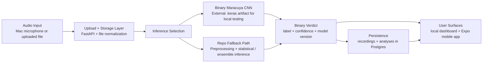

# MaracuyAI

Personalized bioacoustic classification for a single parakeet, `Maracuya`.

MaracuyAI explores a practical question caretakers often answer subjectively: does this bird sound okay, or does it sound stressed?

Technical positioning: this repository is a research-engineering prototype that combines audio preprocessing, binary inference, API design, persistence, and local client surfaces for testing an applied ML workflow end to end.

## Portfolio Summary

This repository is strongest as evidence of:

- applied ML experimentation on real audio data
- audio preprocessing and inference pipeline design
- backend and client integration around a narrow product question
- local-first system thinking, including upload, storage, model selection, and traceability
- collaborative development around a real-world use case rather than a tutorial prompt

The repo should be read as a serious prototype and portfolio artifact, not as a claim of production-validated animal health AI.

## Problem Framing

When a caretaker hears changes in a bird's vocalizations, the judgment is often informal: "this sounds normal" or "this sounds off." MaracuyAI narrows that ambiguity into a binary classification task:

- `good`: the vocal profile appears okay / routine / non-stressed
- `bad`: the vocal profile appears stressed / negative / concerning

The project is intentionally centered on one bird rather than on generalized species-wide classification. That narrow framing is what makes the work credible as an applied ML exercise.

## What The System Does

The intended flow is:

1. record audio or upload an existing clip
2. normalize and preprocess the file
3. run inference through the active model path
4. return a binary label plus confidence
5. persist enough metadata to review the run later

For local testing, the repository includes a browser dashboard optimized for "Mac microphone + phone playback" validation as well as a broader Expo mobile client.

## What Is Technically In The Repo Today

### Backend

- FastAPI application with routes for auth, parakeets, recordings, analysis, and context
- SQLAlchemy models and Alembic migrations
- local media storage with audio normalization and format conversion
- guest-mode auth flow for local operator use
- local dashboard served directly by the backend at `/dashboard/`

### Model And Training Code

- repo-native audio preprocessing and statistical/ensemble inference path
- dedicated binary Maracuya adapter in `backend/app/ml/maracuya_binary_model.py`
- legacy CNN and training pipeline in `backend/app/ml/` and `backend/app/ml/training/`
- TensorFlow, librosa, NumPy, SciPy, and scikit-learn dependencies present in the backend stack

### Client Surfaces

- Expo / React Native mobile app with recording, history, profile, settings, and guide screens
- lightweight local browser dashboard for rapid desktop testing

### Scripts And Operations

- Docker-based local stack
- local dashboard launcher
- operational docs for running and testing the stack

### Documentation

- product definition, system design, data labeling, training notes, and portfolio-facing documentation in [`docs/`](docs/README.md)

## Architecture Snapshot



## Tech Stack

- Backend: FastAPI, SQLAlchemy, Alembic, PostgreSQL, Docker Compose
- Audio / ML: TensorFlow, librosa, NumPy, SciPy, scikit-learn, pydub, noisereduce
- Client: Expo, React Native, TypeScript, Zustand
- Ops / local workflow: Docker Desktop, local browser dashboard, host-mounted model artifact for local inference tests

## Technical Contribution Framing

As a portfolio artifact, the value of MaracuyAI is not just "an app that classifies bird sounds." The stronger story is the engineering judgment behind the system:

- narrowing an overbuilt "wellness" idea into a sharper personalized binary classification problem
- treating the model and labeling workflow as the core product, with client polish as secondary
- wiring a local operator loop that supports realistic testing with microphone capture and uploaded recordings
- integrating model selection, persistence, and UI feedback into a usable end-to-end prototype
- documenting the project in a way that separates prototype capability from validated capability

This is best described as collaborative technical work around a concrete, real-world ML use case.

## Current Maturity

Current status:

- working local prototype / research-engineering artifact
- backend, persistence, upload flow, and local dashboard are operational
- binary inference direction is established
- repo can load an external trained `.keras` model for local testing
- fallback inference path still exists for development continuity

What is not proven by the repo:

- benchmarked model performance
- rigorous held-out evaluation results committed in the repo
- production-grade monitoring or validation
- medical or veterinary diagnostic reliability

MaracuyAI should therefore be presented as a serious prototype, not as a production or diagnostic system.

## Repository Map

```text
.
├── backend/
│   ├── app/
│   │   ├── api/              # FastAPI routes and auth dependencies
│   │   ├── core/             # config, database, security, migrations helpers
│   │   ├── ml/               # binary adapter, legacy CNN, ensemble, training utilities
│   │   ├── models/           # SQLAlchemy models for recordings, analyses, users, etc.
│   │   ├── services/         # storage, preprocessing, inference orchestration
│   │   └── static/dashboard/ # local browser dashboard
│   ├── docker-compose.yml
│   └── requirements.txt
├── mobile/                   # Expo / React Native client
├── docs/                     # product, architecture, operations, and portfolio docs
├── scripts/                  # local run helpers
├── CHANGELOG.md
├── PROJECT_STATUS.md
└── COLLABORATION.md
```

## Running Locally

### Local dashboard workflow

1. Optional but recommended: place a trained binary model at `~/Downloads/modelo_periquitos.keras`
2. Start the local stack:

```bash
./scripts/run_local_dashboard.sh
```

3. Open `http://localhost:8000/dashboard/`
4. Allow microphone access
5. Record from your Mac or upload an audio file

If the external model artifact is present, the backend will prefer it. If not, the repo uses its fallback inference path for local testing.

More detail: [`docs/operations/local-dashboard.md`](docs/operations/local-dashboard.md)

## Portfolio Docs

- [Portfolio audit](docs/portfolio/repo-audit.md)
- [Case study](docs/portfolio/case-study.md)
- [Project highlights](docs/portfolio/project-highlights.md)
- [Architecture notes](docs/portfolio/architecture.md)
- [Evaluation roadmap](docs/portfolio/evaluation-roadmap.md)
- [Project status](PROJECT_STATUS.md)
- [Collaboration framing](COLLABORATION.md)

## Demo Assets To Add

The repo does not currently ship polished public demo media. Strong next additions would be:

- TODO: dashboard screenshot showing upload -> verdict flow
- TODO: short GIF of Mac microphone testing workflow
- TODO: example evaluation artifact such as a confusion matrix or run summary

## Why This Is A Strong Portfolio Project

Recruiters and technical reviewers can read this repository as evidence of:

- ML prototyping on an ambiguous real-world signal
- model-aware product scoping rather than feature sprawl
- backend API design for audio workflows
- client integration across mobile and browser surfaces
- practical data / evaluation discipline, even where validation is still incomplete
- honest communication about maturity, limitations, and next steps

## Limitations And Next Steps

Current limitations:

- the repo does not publish benchmark numbers or formal evaluation reports
- the strongest binary model artifact is mounted locally rather than committed to the repo
- some mobile and context features still reflect a broader historical scope than the current product definition
- automated testing coverage is limited

High-value next steps:

1. freeze the dataset and labeling protocol for a true held-out evaluation set
2. publish model evaluation artifacts in-repo
3. simplify the API contract so binary output is first-class everywhere
4. reduce legacy "wellness platform" surfaces or clearly mark them experimental
5. add demo assets and automated tests to improve external reviewability
