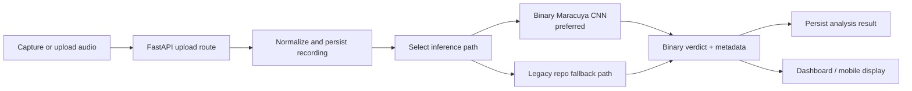

# System Design

## Design Goal

Build a small but credible system that can take a recording, run inference, and return a traceable binary result.

## Repo-Grounded Architecture

### Data and storage layer

- recording upload routes in the FastAPI backend
- file normalization and storage in `backend/app/services/storage_service.py`
- persisted recording and analysis rows in Postgres

### Inference layer

- active binary Maracuya adapter when a local `.keras` model artifact is mounted
- legacy repo-native fallback path using preprocessing, statistical scoring, and broader inference logic
- analysis metadata returned through the API for review and debugging

### Client layer

- local browser dashboard for desktop testing
- Expo mobile app for broader recording and history flows

## Current Architecture Snapshot

## What Is Central Vs Secondary

### Central to the current product

- audio ingestion
- model selection and inference
- binary output
- local testing workflow

### Secondary or legacy

- multi-mood interpretations
- context / weather / AQI features
- broader "wellness" language
- mobile information architecture beyond record -> result -> history

Those secondary systems are still implementation evidence, but they should not define the repo's public story.

## Architectural Direction

The repository should continue moving toward:

- binary-first API contracts
- explicit model-version reporting
- reproducible evaluation artifacts
- thinner client surfaces centered on the inference loop

This direction improves credibility because it reduces ambiguity between "interesting code" and "validated capability."
