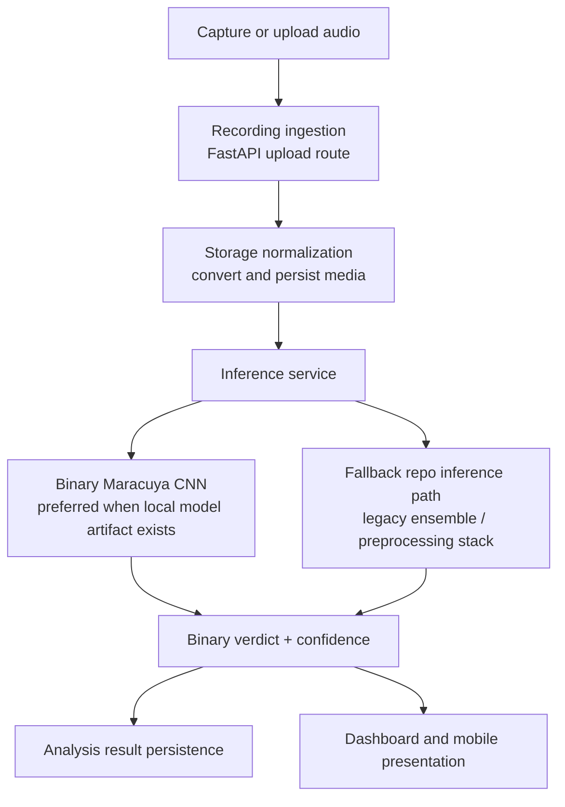
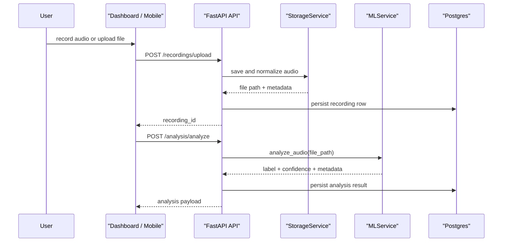
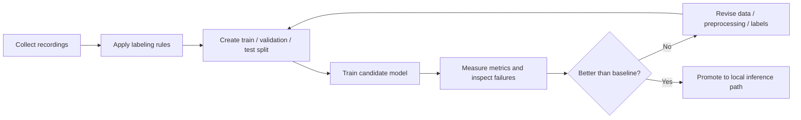

# Architecture Notes

## System View

## From Recording To Result

## Evaluation Workflow

## Current Architectural Reality

### Strong, current layers

- upload + storage
- inference routing
- local dashboard loop
- persistence of recordings and analyses

### Legacy or secondary layers

- broader weather / AQI context engine
- alerting and wellness-summary interpretations
- mobile surfaces that still expose older mood-centric scope

Those secondary layers are still real code, but they are not the center of the current portfolio story.

## Demo Asset Placeholders

- TODO: add screenshot of the local dashboard verdict screen
- TODO: add short GIF of Mac microphone testing flow
- TODO: add screenshot of a mobile recording/upload screen
