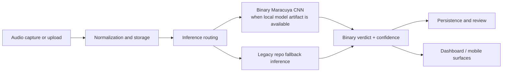

# MaracuyAI Case Study

## Executive Summary

MaracuyAI is a personalized bioacoustic classification project built around a narrow real-world question: when a specific parakeet vocalizes, can a system help classify whether the sound profile appears okay or stressed?

This repository is best understood as a research-engineering prototype. It combines audio preprocessing, model experimentation, inference routing, API integration, persistence, and user-facing local testing. The project does not claim production validation, but it does demonstrate thoughtful scope control and real implementation depth.

## Context And Collaboration

The project emerged from a collaborative, real-world use case rather than from a synthetic benchmark exercise. The domain problem came from a caretaker relationship with one bird, `Maracuya`, and the technical work evolved around that specific context.

That collaboration matters for portfolio framing because it shows:

- the problem was grounded in real user behavior
- audio interpretation and labeling required human judgment, not just code
- the work involved translating subjective caretaker observations into a narrower technical task

The honest framing is collaborative technical development around a personalized ML use case.

## Problem Definition

Bird vocalizations can change in ways that caretakers notice, but those judgments are difficult to make consistently. The project therefore narrows the task to a binary question:

- does the bird sound okay?
- or does the bird sound stressed / negative?

This is not framed as diagnosis. It is framed as ambiguity reduction around audio observations.

## Why Binary Classification Was Chosen

The repository contains signs of broader historical scope, including multi-mood outputs and a wider "wellness" framing. But the strongest technical decision was to simplify the product around a binary classification target.

Binary classification was chosen because it:

- matches the actual user decision more closely than a broad emotional taxonomy
- reduces label ambiguity
- makes evaluation easier to reason about
- lowers the risk of overclaiming model capability
- creates a more credible first milestone for a personalized dataset

This is a good example of engineering scope control: reduce the surface area of the product until the model question becomes measurable.

## System Architecture

At a high level, the system works as follows:

The architecture is important because it shows the project is not only a notebook experiment. It includes:

- ingestion
- storage
- model selection
- inference
- result persistence
- user-facing display

## Data And Labeling Challenges

The hardest part of the project is not UI polish. It is the dataset and labeling discipline.

The repository's current training utilities assume a binary folder structure like `Estres/` and `Feliz/`, which is simple and practical. But the repo does not yet ship a formal evaluation package or benchmark report. That means the technical challenge is not just "train a CNN"; it is:

- define labels consistently
- avoid forcing noisy clips into the dataset
- create train / validation / test splits that preserve integrity
- document failure cases rather than hiding them

This is an important portfolio lesson: in applied ML, data definition is often the real product work.

## Model Development Approach

The repository shows two model paths:

1. a legacy repo-native inference stack with preprocessing, statistical scoring, and ensemble logic
2. a dedicated binary adapter for a collaborator-provided `.keras` model aligned to the narrower problem definition

That combination is valuable because it shows:

- iterative model exploration
- willingness to keep a fallback path while integrating a more specific model
- separation between experimentation and product-facing inference

The repo also contains training utilities for the legacy CNN path, which demonstrates that model development was treated as code, not just as notebook state.

## Inference And Product Integration

The local dashboard is one of the most useful portfolio elements in the repo. It turns the ML work into a practical operator loop:

1. record from the Mac microphone or upload audio
2. send the file to the backend
3. normalize and store the recording
4. run inference
5. return a binary verdict and metadata

This matters because it demonstrates end-to-end execution, not just model training. A hiring manager can see that the project spans interface, backend, persistence, and model behavior in one loop.

## Technical Decisions And Tradeoffs

### Decision: favor a model-first architecture

The project now treats inference quality, labeling clarity, and evaluation rigor as more important than app breadth. That is a strong tradeoff for credibility.

### Decision: keep a fallback path

The repo still contains the broader legacy inference path. That is not ideal from a product-purity perspective, but it is reasonable from an engineering continuity perspective. It preserves a working stack while the dedicated binary model path matures.

### Decision: load the trained binary model externally

The strongest binary model artifact is not committed to the repo; it is mounted locally. This is less convenient for reproducibility, but it is honest. The repo should not pretend it ships a versioned production-ready model when it does not.

### Decision: keep broader mobile/context features visible but secondary

The mobile app and context systems remain in the repo. They show breadth, but they are not the strongest evidence of the product's current center of gravity. They should be framed as experimental or legacy scope.

## What Exists Vs What Remains To Be Validated

### Exists

- backend routes and persistence
- local recording/upload flow
- mobile and browser surfaces
- binary CNN integration path
- repo-native fallback inference path
- training utilities
- local Docker workflow

### Still needs validation

- dataset definition and versioning
- benchmarked evaluation results
- clear acceptance criteria for model promotion
- regression testing for model changes
- cleaner binary-first API and mobile surface

## Lessons Learned

- Narrowing the problem increased credibility more than adding features would have.
- Human labeling and domain judgment are first-class technical concerns in applied ML.
- A working local demo loop is extremely valuable for development and review.
- Carrying legacy scope is acceptable, but only if the docs clearly separate it from the main story.
- Honest maturity language improves portfolio strength because it signals engineering judgment.

## Why This Project Matters As Portfolio Proof

MaracuyAI works well as portfolio proof because it demonstrates more than one skill at once:

- model experimentation under uncertain labels
- product scoping discipline
- audio pipeline engineering
- backend and client integration
- local operational tooling
- thoughtful communication about limits and evidence

That makes it a stronger artifact than a tutorial classifier or a thin UI wrapper around an API.
