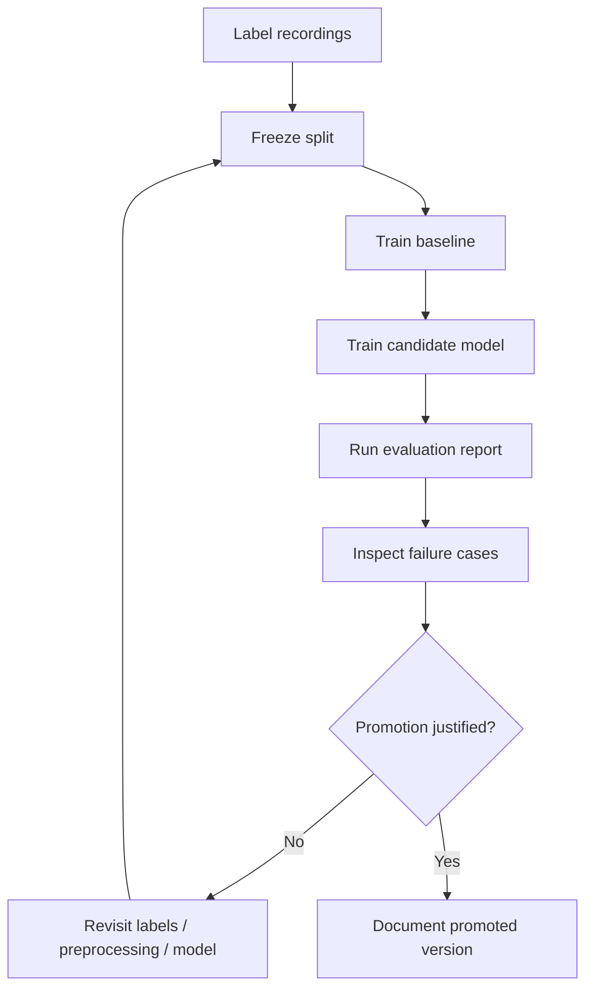

# Evaluation Roadmap

## Purpose

This roadmap separates what the repo can do operationally from what still needs to be proven scientifically or product-wise.

## What The Repo Already Supports

- audio ingestion and normalization
- binary inference routing
- recording and analysis persistence
- local dashboard and mobile testing surfaces
- training utilities for the legacy CNN path
- local loading of a trained `.keras` model for the dedicated binary path

## What Is Not Yet Proven By The Repo

- benchmarked accuracy, precision, recall, or F1
- documented held-out test performance
- stability across repeated recordings of the same behavior class
- false positive / false negative tradeoff analysis
- model regression tests across versions

## Recommended Evaluation Stages

### Stage 1: dataset discipline

- define binary labels unambiguously
- remove low-quality clips from evaluation
- version the train / validation / test split

### Stage 2: baseline

- train a simpler baseline
- record where it fails
- make the CNN earn its complexity

### Stage 3: candidate model review

- evaluate the current binary model on a held-out set
- log confusion matrix, precision, recall, and F1
- review the misclassifications manually

### Stage 4: promotion

- only promote a model when it beats the baseline and its failure modes are understood
- record the model version and data split used for that decision

## Evaluation Lifecycle

## Metrics To Publish

- accuracy
- precision
- recall
- F1 score
- confusion matrix
- count of recordings and segments evaluated

If classes are imbalanced, headline accuracy alone should not be used.

## Artifacts That Would Strengthen The Repo

- a committed evaluation report in `docs/portfolio/` or `research/`
- a confusion matrix image or Markdown table
- a short note on the dataset split and labeling policy used for the reported run
- a versioned promoted-model note that links inference behavior to a specific artifact

## Conservative Promotion Rule

The repository should not claim a model is "validated" or "production-ready" until:

- evaluation is reproducible
- metrics are written down
- failure cases are documented
- the model artifact and configuration are versioned clearly
